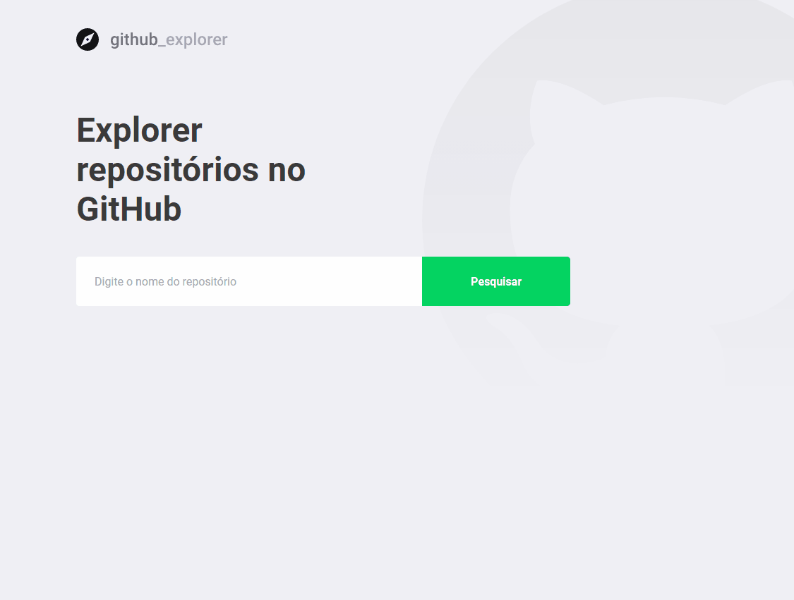

<p align="center">
  </a>
</p>

<h1 align="center">
GitHub Explorer
</h1>

<p align="center">
  
</p>

## :octocat: Sobre o Projeto :octocat:

  Esse projeto foi desenvolvido durante o Bootcamp GoStack, organizada pela Rocketseat.

  O Github Explorer é um aplicativo de busca dentro do GitHub, ele consome a API pública do Github para mostrar ao usuário os repositórios que ele procura.

  A aplicação guarda na Storage os repósitórios já procurados e listados e, ao clicar em algum repositório específico, o usuário é
enviado para uma segunda página onde as issues dele estão listadas. Ao escolher uma issue, o usuário é levado até a página do repositório dessa issue.

## :computer: Tecnologias :computer:
  Muitas ferramentas foram utilizadas para o desenvolvimento do Github explorer. Entre elas estão:

- TypeScript
- React
  - React Icons
  - React Leaflet
  - React Dom
  - React Router Dom
- Styled Components
- Polished
- Axios
- ESlint
- Prettier

## Ambiente de Desenvolvimento

Para rodar essa aplicação em sua máquina, você precisará de um ambiente NodeJs básico instalado.

**Clonando o repositório:**

```
$ git clone https://github.com/lucasoliveiraa/GitHub-Explorer.git
```

### Instalando:


**Front-End**
- Digite `yarn install` na pasta `github-explorer` para instalar todas as dependências;
- Digite `yarn start` para rodar o projeto;


Made with ♥ by Lucas Oliveira :computer: [Get in touch!](https://www.linkedin.com/in/lucas-da-costa-oliveira-b75b30125/)
